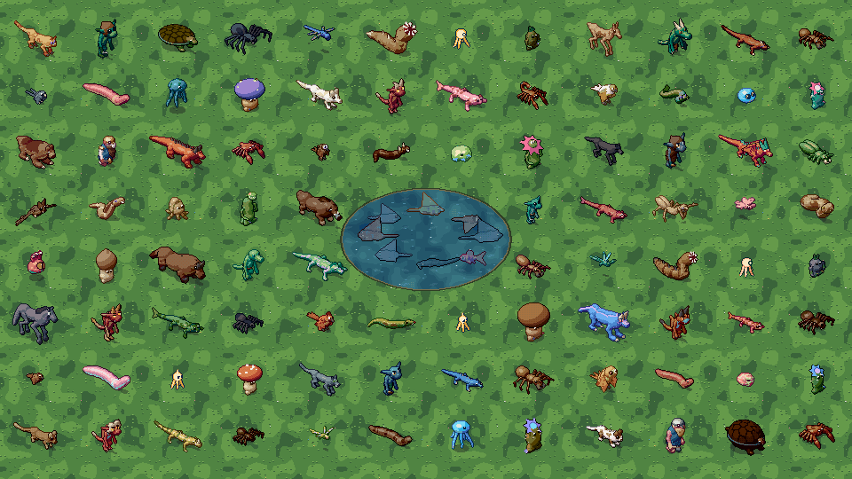
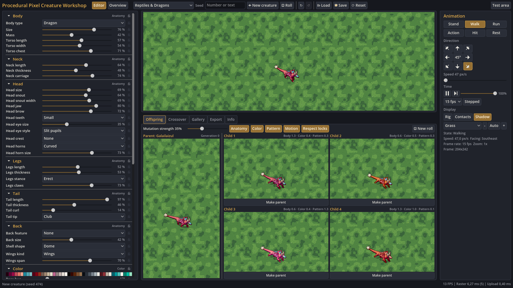
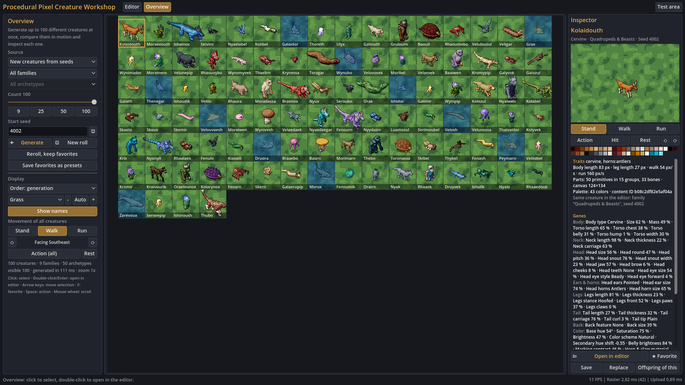
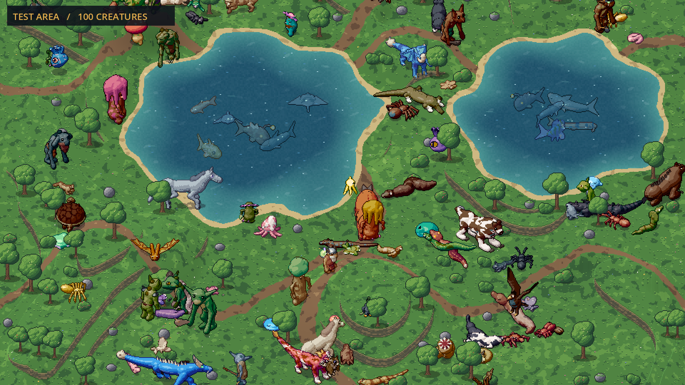
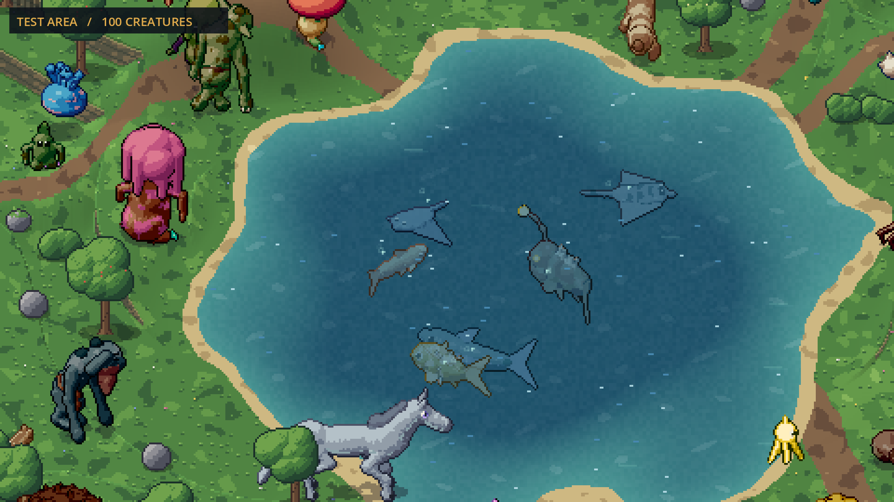
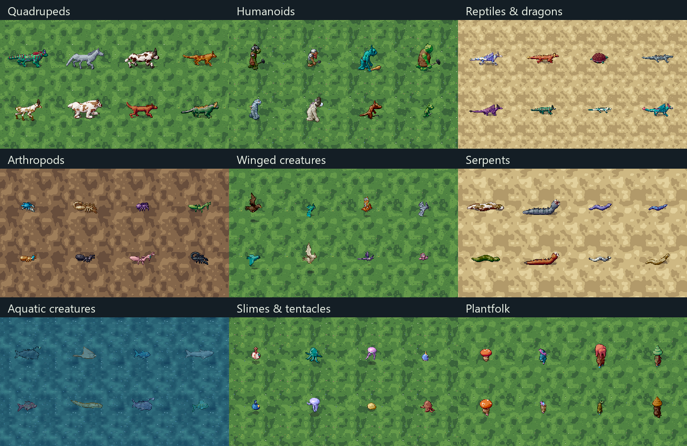

# Procedural Pixel Creatures



[](https://discord.gg/KmbhM2mJdH)

A pixel creature generator, animation framework and genetics workshop built with **Godot 4.5.2 .NET / C#**.
Body shapes, limbs, faces, colors, markings, rigs and movement are generated in code.
There are no premade creature sprites or AI-generated source images. After the initial setup,
the application runs offline without an AI service.

Explore nine creature families, edit their genes, breed new variants and watch up to 100 creatures
roam a landscape with hills, cliffs and underwater habitats.

Built primarily with Claude Opus 5.5 from one initial prompt, followed by
refinements with GPT Astra. The author's estimate is roughly 95% initial prompt and 5% follow-ups.

## Quick start

1. Clone this repository or choose **Code → Download ZIP** on GitHub.
2. Extract the ZIP into a writable folder on **Windows 10/11 x64**.
3. Double-click **`Start.cmd`**.

The launcher downloads missing tools, builds the project and opens the workshop. You do not need
to install Godot or .NET yourself, choose executable paths, or run as administrator.
The first setup needs an internet connection; subsequent starts reuse the downloaded tools.

## What it does

| Mode | Features |
|---|---|
| **Workshop** | Edit individual genes, lock traits, reroll the rest, undo/redo, inspect rigs and foot contacts, and preview animation with a fixed camera. |
| **Genetics** | Generate four animated offspring with adjustable mutation strength, or combine two compatible parents. |
| **Overview** | Generate 1–100 creatures, filter by family or archetype, keep favorites during rerolls, and send any creature back to the editor. |
| **Test area** | Explore five map sizes with terraced hills, slopes, cliffs, vegetation and ponds. Land creatures follow the terrain; aquatic creatures swim below the water surface. |
| **Export** | Save versioned JSON presets, transparent PNGs, or sprite sheets with animation metadata and a playback preview. |
| **Framework** | Use the engine-independent C# core or Godot `CreatureActor` in your own project. Plantfolk demonstrate how to add a family through the public extension API. |

| Workshop | 100-creature overview |
|---|---|
|  |  |
| **Living terrain** | **Underwater swimming** |
|  |  |

The nine families are **quadrupeds, humanoids, reptiles and dragons, arthropods, winged creatures,
serpents, aquatic creatures, slimes and tentacled creatures, and plantfolk**. Variation changes body
structure as well as appearance. Humanoids also receive procedural clothing, armor and equipment.
The repository includes 54 sample genomes: six per family.



Animation includes standing, walking/running or anatomy-specific movement, actions, hit reactions
and rest. Creatures support eight facing directions. Seeds and separate anatomy, color, pattern
and motion streams make results reproducible for a given generator version.

## Requirements

| Platform | Setup |
|---|---|
| **Windows 10/11 x64** | Automatic setup through `Start.cmd`. PowerShell 5.1 and a graphics driver supporting Godot's Compatibility renderer are required. |
| **Linux / macOS** | Install **Godot 4.5.2 .NET** and a **.NET 8 SDK/runtime** yourself, then use the shell scripts below. The current release was validated on Windows. |

The Windows launcher pins Godot **4.5.2 .NET** and uses a compatible installed SDK/runtime pair or
downloads a private **.NET SDK 8.0.425**. Official Godot/Microsoft archives are checked against pinned
SHA-512 hashes and stored in `.tools/`. Environment changes apply only to the launcher and its
child processes. A generated, project-local `NuGet.Config` points to Godot's bundled packages.

Allow a few gigabytes of free space for tools and build caches.

## Starting

| Windows command | Opens / does |
|---|---|
| `Start.cmd` | Workshop |
| `Start.cmd overview` | 100-creature overview |
| `Start.cmd testarea` | Interactive test area |
| `Start.cmd editor` | Godot editor with the selected .NET SDK available |
| `Start.cmd -PrepareOnly` | Download, build and import without opening the app |
| `Start.cmd -NoBuild` | Reuse the last build; build once if missing |
| `Start.cmd help` | Launcher options |

On Linux/macOS, set `GODOT` to your Godot .NET executable if it is not named `godot` on PATH:

```bash
export GODOT=/path/to/godot
bash scripts/start.sh             # Add --overview or --testarea
bash scripts/check.sh --quick
```

On Windows, failed starts leave the console open with the error. Fix the reported issue and run
`Start.cmd` again; interrupted setup can be retried. Logs are under
`%APPDATA%/Godot/app_userdata/Procedural Pixel Creature Workshop/logs/`.

## Working in the Godot editor

Run **`Start.cmd editor`** to open the project with the correct toolchain. Press **F5** in Godot to
run the workshop. The main scene is `workshop/Main.tscn`; the minimal integration scene is
`examples/minimal_integration/MinimalIntegration.tscn`.

The main project builds optimized C# even in Debug because creature rasterization runs on the CPU.
After changing C# code, rebuild through the editor or restart with `Start.cmd`.

For integration, copy `addons/procedural_creatures/` into another Godot .NET project and follow
the [minimal example](examples/minimal_integration/MinimalIntegration.cs). Copy
`addons/procedural_creatures_plantfolk/` too if you want the ninth family. The
[architecture guide](docs/ARCHITECTURE.md#extensions) describes the registration hooks.

### Exporting a game build

This repository is a source release. In Godot, install the matching **4.5.2 .NET export templates**
and add a Windows Desktop or Linux preset through **Project → Export**. Export into `build/`, which
is ignored by Git. Follow [Godot's export documentation](https://docs.godotengine.org/en/4.5/tutorials/export/exporting_projects.html)
for platform requirements. Native release binaries are not included or validated by this source package.

## Controls

### Workshop and overview

| Input | Action |
|---|---|
| F2 | Switch between editor and overview |
| F5 in the workshop / G in the overview | Reroll |
| Ctrl+Z / Ctrl+Y | Undo / redo in the editor |
| Ctrl+S / Ctrl+O | Save / load a preset in the editor |
| 1 / 2 / 3 | Stand / walk / run |
| Q / E | Turn |
| Space / R | Action / rest |
| H / P / N in the editor | Hit reaction / pause / single simulation step |
| Click; double-click or Enter in the overview | Select; open the selected creature in the editor |
| F in the overview | Toggle favorite; favorites survive "Reroll, keep favorites" |
| Ctrl+wheel in the overview | Change integer zoom |

### Test area

| Input | Action |
|---|---|
| WASD or arrow keys; Shift | Move the controlled creature; run |
| Tab / click a creature | Choose a creature to control |
| Space / R / H | Action / rest / hit reaction |
| + / − or population buttons | Change population from 1 to 100 |
| Page Up / Page Down | Increase / decrease map size |
| N / G | Generate a new map / reroll the population |
| Mouse wheel | Zoom |
| Right- or middle-button drag | Pan the camera |
| F | Follow the controlled creature again |
| M / click the minimap | Toggle minimap / move camera there |
| F1 / Esc | Toggle controls / return to workshop |

## Files

Presets use the versioned `ppc.creature` JSON format. A seed reproduces a creature with the same
family and generator version; saved genomes retain edited genes and separate random streams.
Sprite sheets include JSON describing directions, frames, pivots and timing.
See [serialization and export](docs/ARCHITECTURE.md#export).

Saved presets and exports default to Godot's `user://` directory. On Windows this is
`%APPDATA%/Godot/app_userdata/Procedural Pixel Creature Workshop/`. These files are separate from
the repository and are not removed by rebuilding it.

## Project layout

| Path | Purpose |
|---|---|
| `addons/procedural_creatures/Core/` | Engine-independent generation, genetics, rigging, animation, rasterization and export |
| `addons/procedural_creatures/Runtime/` | Godot actors, asynchronous generation, rendering and texture uploads |
| `addons/procedural_creatures_plantfolk/` | Example extension family and sample genomes |
| `workshop/` | Editor, overview, genetics UI and terrain simulation |
| `examples/minimal_integration/` | Small Godot integration example |
| `tests/` | Core/runtime tests, benchmarks and sample export verification |
| `scripts/` | Automatic Windows setup, launchers, checks and source packaging |
| `tools/core_harness/` | Console harness for the core without Godot |
| `docs/ARCHITECTURE.md` | Framework architecture and integration details |

The [architecture guide](docs/ARCHITECTURE.md) explains generation, animation, rendering and terrain integration.

## Self-tests

```powershell
powershell -NoProfile -ExecutionPolicy Bypass -File scripts/check.ps1
```

This builds and imports the project, runs the **17 core tests with 100 seeds per family**, then runs
**28 Godot self-tests** headlessly. Add `-Quick` for 10 seeds per family. Tests include deterministic
golden values, genetics, export round trips, terrain/water clearance, population changes and stable
workshop preview framing. Reports go to the ignored `reports/` directory; failures return a nonzero exit code.

The engine-independent tests can also run with just the .NET 8 SDK:

```bash
dotnet run -c Release --project tools/core_harness -- test reports all 100
```

GitHub Actions is configured to run the full checks on Windows for pushes and pull requests.

## License

[MIT](LICENSE), copyright © 2026 idlerunner00. Algorithm attributions and applicable third-party
terms are preserved in [THIRD_PARTY_NOTICES.md](THIRD_PARTY_NOTICES.md).
